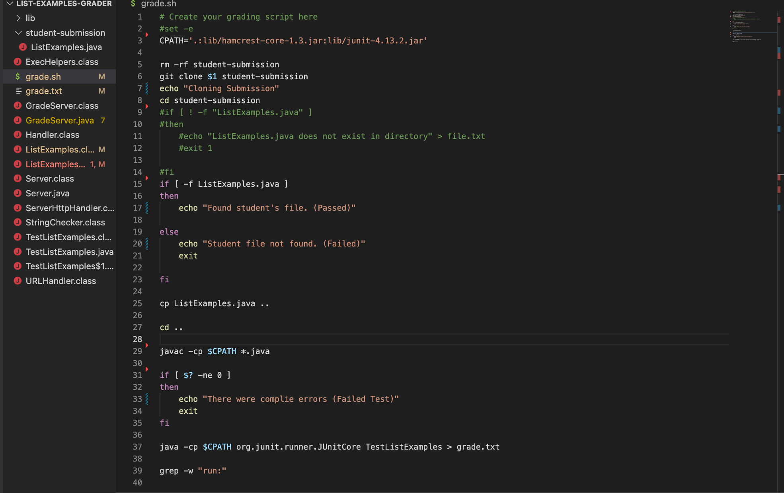
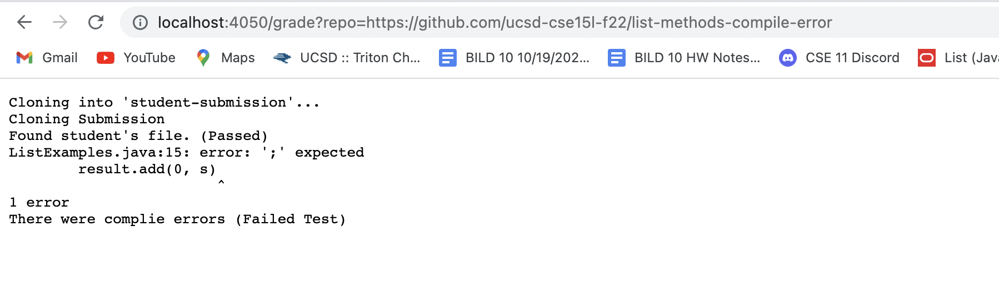
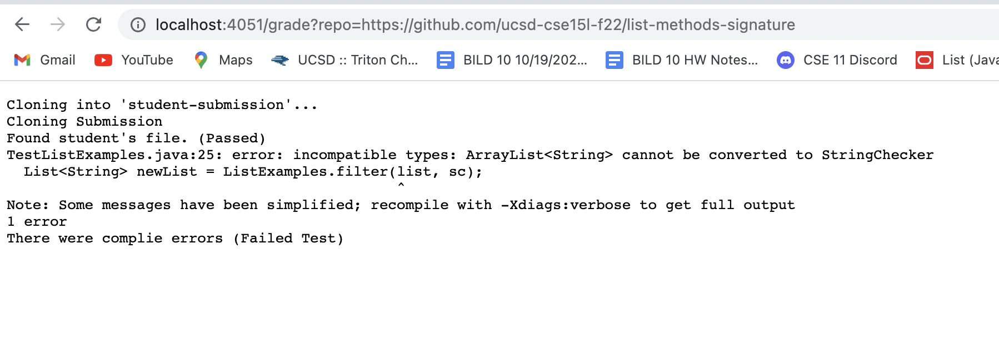
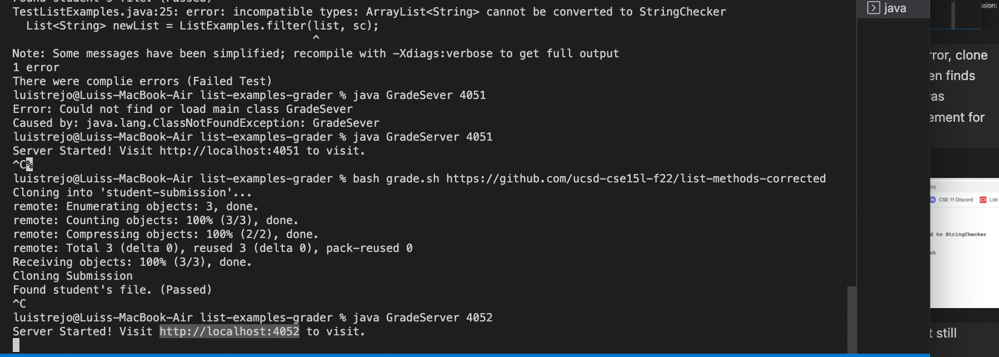
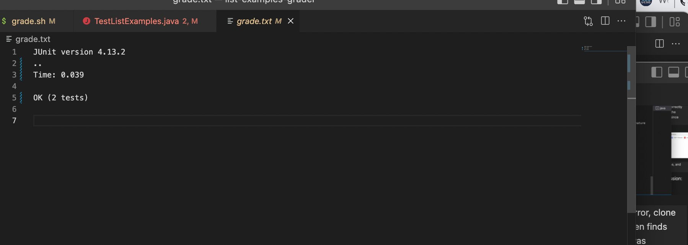
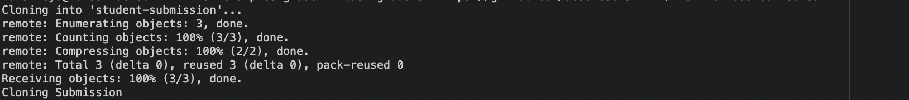

# Lab Report #5 (Week 9): Grade Server

> Goal for this Lab Report #5 is create a grade.sh that helps you identify what code is correct and what is not, and this is basically a small example of how gradescope works. 

## Code Block for Grade.sh

Screenshot for code:

- I would like to acknowledge the student named adarsh249, as I reviewed his coding and really got some ideas to implement on my code, so I like to acknowledge this student, Thank You!!

**1st Example of Student Submission: Compile Error**

Screenshot for Terminal: 

> In this the terminal basically runs some tests to show if the submission from the student is done correctly and in this it passes the first case of finding the student's file but doesn't pass the next one since there is a grammar error. 

Screenshot for the Browser:

> This shows what would be the failed test case, and what needs to be improved on.

## **2nd Example of Student Submission: Signature**

> In this the terminal runs similar to Compile Error, clone the submission, finds the specific file and then finds the compile error of this submission which was involving `incompatible types` in this statement for filter.

Screenshot for the Browser:

> Wrong types mean compiled errors, means it still needs more working on to pass these tests.

## **3rd Example of Student Submission: 

> In this the terminal, runs similar to the other two, however after that it shouldn't return anything else, and that would mean that it is completed with no compile errors and that means it passes.

> In this case, I should have had an additional line of code that says all tests passed in this case.

Screenshot for the Browser:

- For some weird reason, the web server doesn't want to work and doesn't load up the solution which should something similar to grade.txt like this 

***

# Part 2: Tracing the Script

> In this second part of the assignment out of the three examples, choose one and talk about how your code block connects and gets the result that you code gives.

- `I will select the second example which is the signature error.`

This is the one I will look at:

So first we have to look back at the code so we understand how it works, here it is again.

> So from lines 3 to 8, these lines are just copying/ cloning the "student's submission" and in these lines is where you get all of these output in the terminal.

- Afterwards is where the coding of the student's submission comes in, and this is where these two if statements come to play

- In the first if statement, it is a simple test basically stating if the student submission contains ListExamples.java and this tells if it contains it then it found the file and passes the test, and if not then it fails the first test.

- Second if statement, it is a test to test out that it gets passes the Junits that are included in the grader, if it does then it should show nothing (just in my code, because I missed adding that info) but if it fails the test then it would echo the message `There were errors in the submission`. 

- In this case of `signature` example that I selected, actually passes the first if statement because there is a listexamples.java and in this case it would return a `non-zero`.
- However, it does not pass the second if statement test and that is because there are errors with the code that is given in student submission and this ends up with a failed test and returns a zero in this case, however even if you get it right you would end up with a zero here to because there wasn't any code basically telling it passes. 

